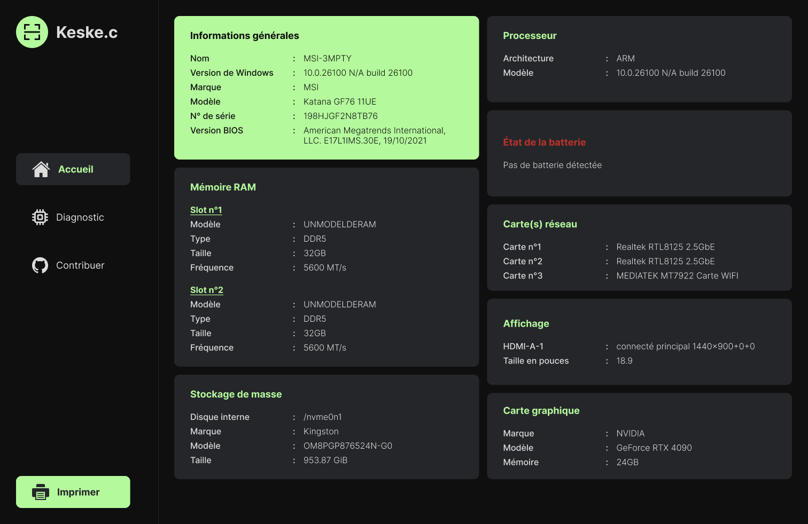

# 🤖 Keske.c

**Keske.c** est une application légère, open-source, développée avec **Tauri (Rust + React)**, qui permet de récupérer et afficher les informations système d’un PC.

Ce projet est né dans le prolongement de l’outil **"Toolbox"** de [La Capsule](https://github.com/lacapsule)), qui fournis les mêmes diagnostics mais via des scripts Bash pour les distributions Linux.

**Keske.c** s'adresse aux développeurs, formateurs, techniciens ou simples curieux qui souhaitent obtenir un **état des lieux complet d'une machine Windows**, dans une interface sobre et rapide.

---

## 🚀 Fonctionnalités principales

- Affichage des informations **CPU, RAM, GPU, stockage**, et **batterie** (si portable)
- Exécution de **scripts PowerShell natifs** en arrière-plan
- Interface moderne développée en **React + TypeScript**
- Application **ultra-légère**

---

## 🛠️ Stack technique

- 🦀 **Rust** pour le backend natif (scripts système, bridge Tauri)
- ⚛️ **React** avec **TypeScript** pour le frontend
- 🧱 **Tauri** comme framework de build et communication front/back
- 🧩 **PowerShell** pour les infos système Windows

---

## 📦 Installation & Lancement

### 🔧 Prérequis

- [Rust](https://www.rust-lang.org/tools/install)
- [Node.js (v18+ recommandé)](https://nodejs.org/)
- [Tauri CLI](https://tauri.app/v1/guides/getting-started/setup/)
  
  ```bash
  cargo install tauri-cli
  ```
  

### 🚀 Lancer le projet

```bash
# Cloner le repo
git clone https://github.com/just3mpty/keske-c.git
cd keske-c

# Installer les dépendances frontend
npm install

#Lancer l'app en dev
npm run tauri dev
```

---

### 🤝 Contribuer

Les contributions sont les **bienvenues** !

Que tu sois débutant ou confirmé, tu peux tout à fait participer !

#### 📍 Exemple de contributions possible :

- Ajouter des modules (diagnostic réseau, température, etc.)
  
- Améliorer l'UI/UX
  
- Ajouter des tests
  
- Traduction
  
- ...
  

#### 📜 Pour commencer

1. Fork le repo
  
2. Crée une branche : `git checkout -b feat/<nom_de_ta_feature>`
  
3. Fais tes modifs
  
4. Crée une PR
  

---

### 📄 License

Projet distribue sous license GNU - General truc

---

### 📸 Screenshots



---

### 📬Contact

Une question, une idée, envie de collaborer ? Tu peux me contacter via *3mpty.dev@gmail.com* ou ouvrir une issue directement sur Github.
